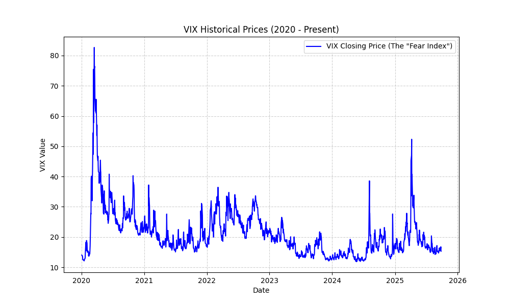
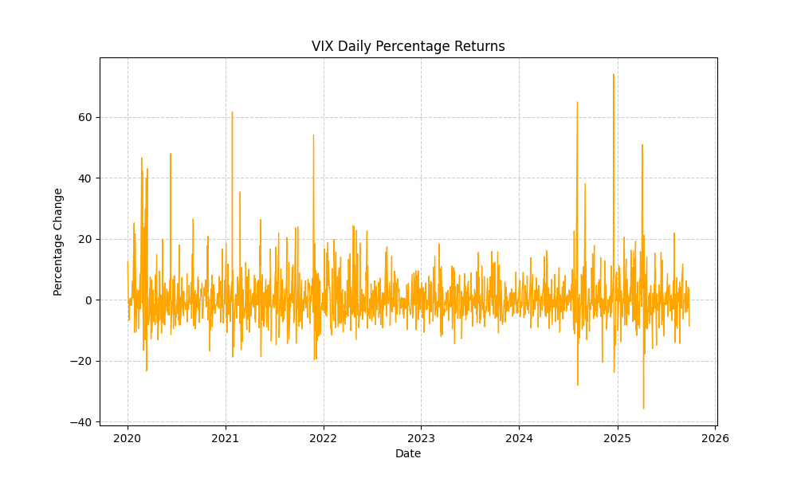
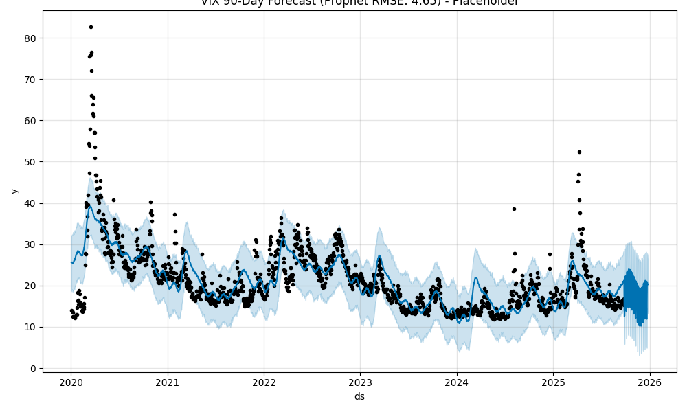
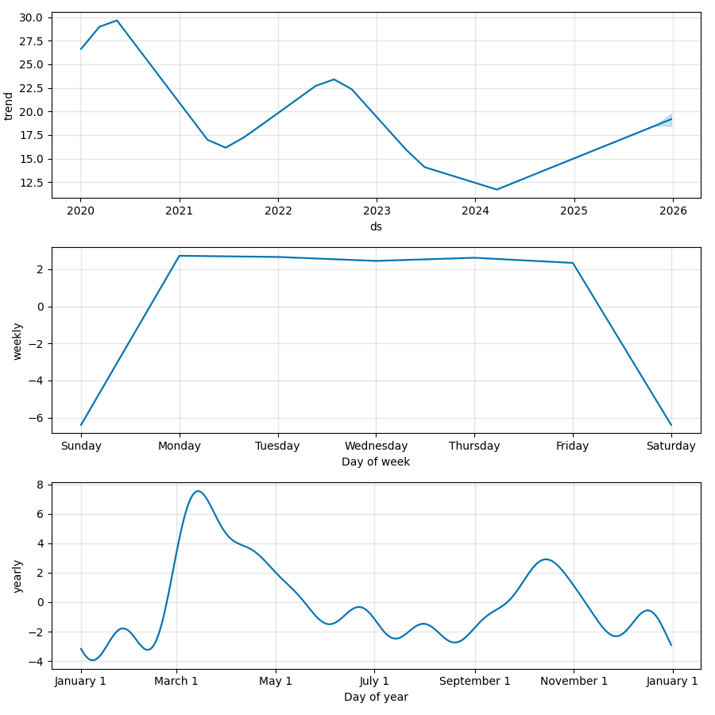
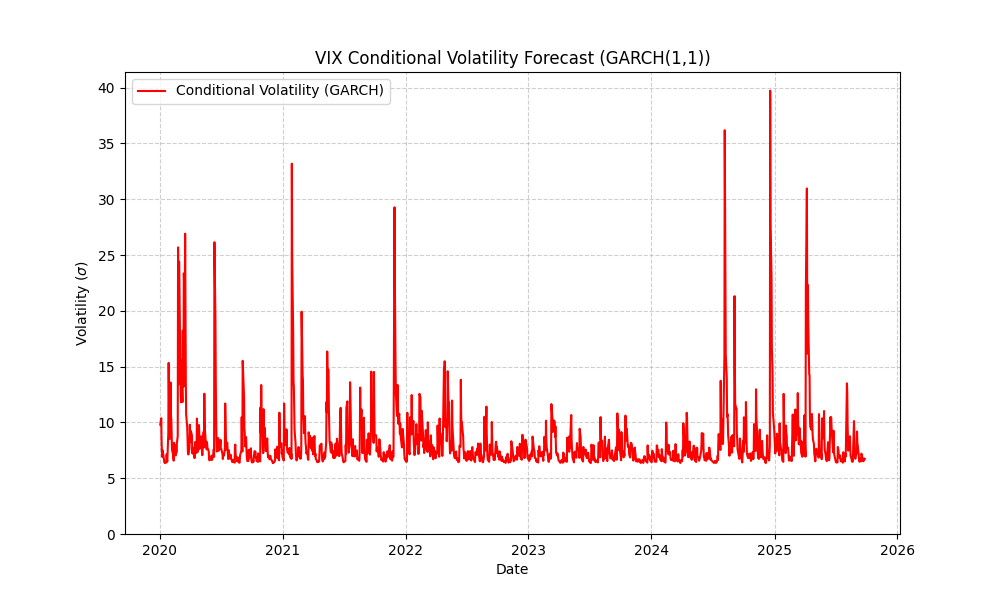

# VIX Volatility Forecasting and Analysis (GARCH vs. Prophet)

## 🎯 Project Goal

This project aims to **forecast the VIX Index** (The "Fear Index") and rigorously analyze its unique financial characteristics: **mean-reversion** and **volatility clustering**. We establish a machine learning baseline using Prophet and compare it to an advanced econometrics model, **GARCH(1, 1)**, specifically designed for financial risk.

***

## ✨ Key Findings

1.  **Prophet Failure on Price:** The Prophet model (designed for sales/business forecasting) proved inadequate for predicting VIX price, achieving a high **RMSE of 4.65** on the 90-day test set. It failed because it inherently **smooths out** the sudden, sharp volatility spikes that define the VIX.
2.  **GARCH Success on Volatility:** The **GARCH(1, 1)** model successfully captured the VIX's **volatility clustering**. The model's conditional volatility perfectly tracked periods of high market fear (spikes) and low market calm, making it the appropriate tool for VIX **risk analysis**.
3.  **VIX Characteristics Validated:** Data exploration confirmed the VIX is **mean-reverting** (always returns to a stable mean after a spike) and highly **heteroskedastic** (its variance changes over time).

***

## 📊 Results and Visuals (5 Figures Included)

### 1. VIX Historical Price and Returns (EDA)

This foundational data analysis confirms the $\text{VIX}$'s highly volatile and mean-reverting nature, a key sign that $\text{GARCH}$ is necessary.

| Figure | Description | Visual |
| :--- | :--- | :--- |
| **Figure 1** | **VIX Historical Closing Price** |  |
| **Figure 2** | **VIX Daily Percentage Returns** |  |

***

### 2. Prophet Model (Baseline) Analysis

The Prophet model captures the long-term trend but is fundamentally unable to model the sudden, sharp volatility spikes.

| Figure | Description | Visual |
| :--- | :--- | :--- |
| **Figure 3** | **VIX 90-Day Forecast (Prophet RMSE 4.65)** |  |
| **Figure 4** | **Prophet Model Components** |  |

**Prophet RMSE: 4.65**

***

### 3. GARCH Conditional Volatility Forecast

The $\text{GARCH}(1, 1)$ model successfully estimates the conditional variance, where the red line represents the predicted **risk level ($\sigma$)**. Its peaks align perfectly with the highest periods of market instability.

| Figure | Description | Visual |
| :--- | :--- | :--- |
| **Figure 5** | **GARCH Conditional Volatility ($\text{GARCH}(1, 1)$)** |  |

***

## ⚙️ Project Structure and Setup

### Technologies Used

* **Python 3.8+**
* **Data Retrieval:** `yfinance`
* **Time-Series Models:** `prophet`, `arch` (for $\text{GARCH}$)
* **Data Analysis:** `pandas`, `numpy`, `matplotlib`
* **Evaluation:** `sklearn`

### Installation and Execution

1.  **Clone the repository:**
    ```bash
    git clone [https://github.com/SahalMurshid/vix-volatility-forecasting-garch.git](https://github.com/SahalMurshid/vix-volatility-forecasting-garch.git)
    cd vix-volatility-forecasting-garch
    ```
2.  **Create and activate a virtual environment:**
    ```bash
    python -m venv venvix
    source venvix/bin/activate  # macOS/Linux
    # OR .\venvix\Scripts\activate # Windows PowerShell
    ```
3.  **Install dependencies:**
    ```bash
    pip install -r requirements.txt
    ```
4.  **Run the analysis script:**
    ```bash
    python vix_data.py
    ```
The script will download the latest VIX data, perform the EDA, run both models, calculate the RMSE, and display all final plots.

---
**Author:** Sahal Murshid
**Date:** September 2025
```eof